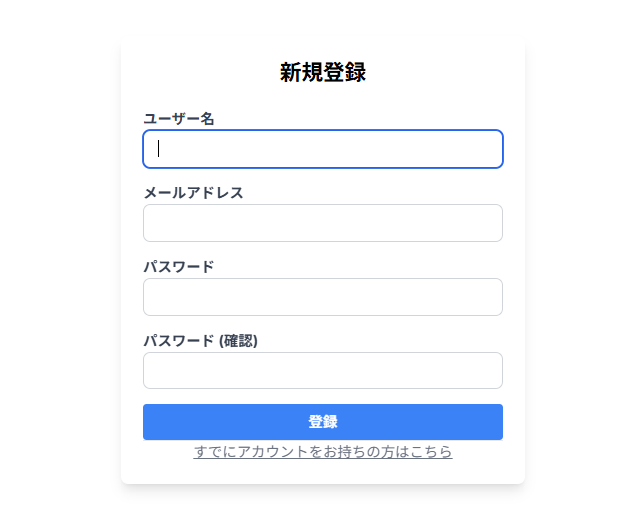
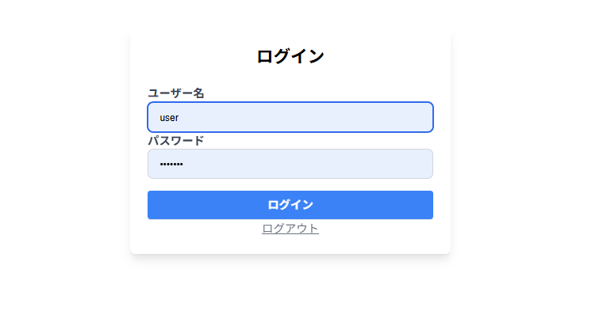
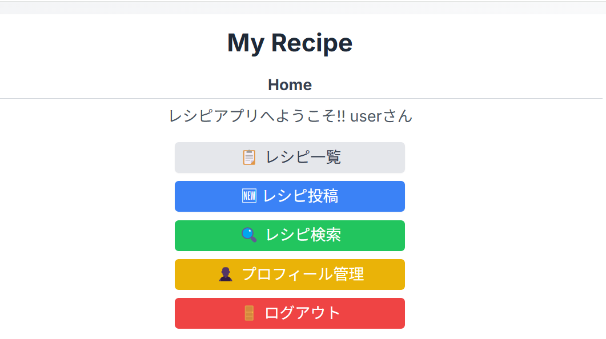
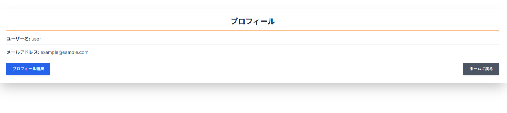
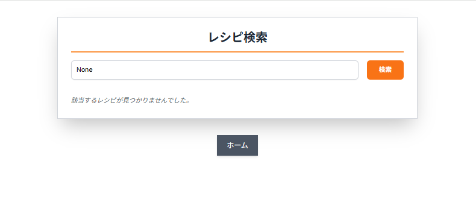

# レシピアプリ(RecipeApp)

## 概要
このアプリは、ユーザーがレシピを投稿・管理できるWebアプリ。Djangoを使用しており、ユーザー登録、ログイン機能に加え、検索やお気に入り登録、レビュー投稿など、料理を楽しむため

## 開発目的
訓練校で学んだ内容(Python・Django)をもとに、Webアプリケーション開発の流れを学ぶため制作。
ログイン機能やCRUD処理、検索・フィルタリング機能など、基本的な機能を一通り実装している。
また、もともと料理が趣味で、日常的にレシピを調べたり記録している中で、「自分でも使いたい」と思えるレシピ管理アプリを作りたいと考えたことがきっかけで使いやすさやほしい機能を自分の視点で取り入れながら開発を進めた。

## 使用技術
-Python 3.x
-Django 4.x
-SQLite3
-Tailwind CSS

## 主な機能一覧

| 分類 ｜ 機能名 | 内容｜

|------|--------|-----|

|ユーザー管理|ログイン/ログアウト| アカウントによるログインとログアウト|
|ユーザー管理|プロフィール編集|アイコン、名前、メールアドレスの編集|
|レシピ管理|レシピ投稿 / 編集 / 削除| 画像付きでレシピの登録・編集・削除ができる|
|検索機能|キーワード検索|タイトルや材料名でレシピ検索|
|レシピ管理|お気に入り登録|レシピをお気に入りとして保温し一覧で表示|
|レシピ管理|レビュー投稿|コメントや評価の投稿ができる|

##  スクリーンショット

### 新規登録

### ログイン

### ホーム画面

### プロフィール

### レシピ検索

## セットアップ方法

1. Python(バージョン3.13.3)をインストール
- コマンドプロンプトを開き、以下のコマンドを実行してインストールされているか確認をする。
python -- version

(※環境によっては 'python3 --version' を使う場合もある。)

2. Django(バージョン4.2.2)をインストール
- 以下のコマンドを実行してDjango4.2.2をインストールする。
pip install django==4.2.2

3. マイグレーションファイルを作成する。
- 以下のコマンドを実行して、マイグレーションファイルを作成する。
python manage.py makemigrations

4. データベースを作成する。
- 以下のコマンドを実行して、マイグレーションファイルを作成する。
python manage.py migrate

5. サーバを起動する
- 以下のコマンドを実行して開発用サーバーを起動する。
python manage.py runserver

6. ブラウザでアプリケーションにアクセスる。
- サーバーが起動したら、ブラウザ上で以下のURLにアクセスする。
http://127.0.0.1:8000/

